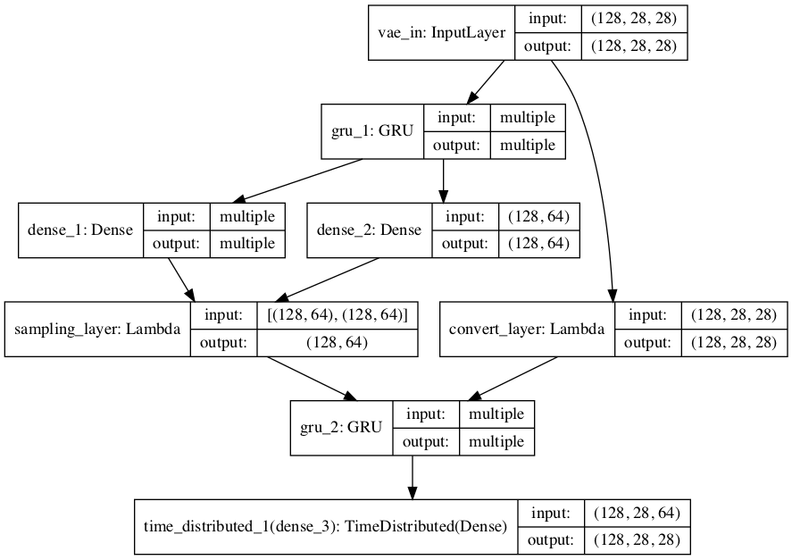

## An RNN based VAE for MNIST data
This repository is an exercise project using a sequence variational auto-encoder (VAE) to encode and generate MNIST hand-written digits.

A simple script to interpolate between latent representations of 2 mnist digits is also included.
### Model Architecture


### Dependencies
Other than python built-in modules, the following are additional required dependicies 
- numpy
- keras==2.2.2
- tensorflow==1.10.0
- matplotlib==2.1.2

### Usage
The model is implemented in file `model.py`, and the code to train is written in `train.py`.
```bash
python train.py  # pass -h option for more options
```
After running `train.py`, trained model is saved in `saved_models/`

To interpolate between digits, run
```bash
python interpolate.py  # pass -h option for more options
```
